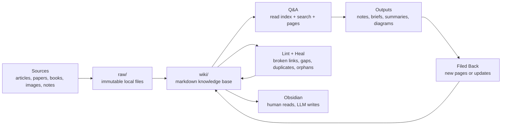

# LLM Wiki

This repo turns Andrej Karpathy's ["LLM Wiki" gist](https://gist.github.com/karpathy/442a6bf555914893e9891c11519de94f) into a concrete local starter kit for an agent-maintained markdown knowledge base.

The model is simple:

- `raw/` stores immutable source material.
- `wiki/` stores the compiled, synthesized markdown knowledge base.
- `outputs/` stores saved briefs, reports, and durable answer artifacts.
- `AGENTS.md`, `CLAUDE.md`, and `PROMPTS.md` make the workflow portable across coding agents.
- `python3 -m llm_wiki ...` handles ingest, batch processing, indexing, search, linting, repair, and report generation.

## Architecture

The core loop is: collect raw sources, process and synthesize them into a markdown wiki, answer questions against it, and file durable outputs back into the wiki.



## Quick Start

```bash
python3 -m llm_wiki init .
python3 -m llm_wiki compile
python3 -m llm_wiki ingest-url "https://example.com/article"
python3 -m llm_wiki ingest /path/to/source.pdf --title "Example Source"
python3 -m llm_wiki ingest /path/to/diagram.jpg --title "System Diagram"
python3 -m llm_wiki hook install --status-output outputs/status.md
python3 -m llm_wiki watch --status-output outputs/status.md
python3 -m llm_wiki search "attention mechanisms"
python3 -m llm_wiki status --output outputs/status.md
python3 -m llm_wiki brief "attention mechanisms" --output outputs/attention-brief.md
python3 -m llm_wiki lint
python3 -m llm_wiki heal
```

Obsidian is optional. Any text editor plus a local-file-aware coding agent will work. The workflow lives in `AGENTS.md`, `CLAUDE.md`, and `PROMPTS.md`.

## How To Use It

Treat this repo as a persistent thinking layer: a structured second brain that compounds knowledge over time.

1. Ingest new material, or drop multiple files into `raw/inbox/` and run `compile`.
2. Use `ingest-url` for articles you want captured as immutable markdown snapshots.
3. Immediately improve the generated source page with a real summary, key points, and open questions.
4. Pull durable ideas into reusable concept, entity, and analysis pages.
5. Link pages aggressively through `## Related Pages`.
6. Search the wiki before answering important questions.
7. File durable answers back into the wiki instead of leaving them in chat history.
8. Use `brief` when you want a clean markdown report in `outputs/` from a query or a set of pages.
9. Run `status`, `lint`, and `heal` regularly.

### What Matters Most

- The first paragraph of every page is critical. It powers both `wiki/index.md` and fast retrieval.
- Generated pages include lightweight YAML frontmatter for title, dates, source count, and status.
- Keep `raw/` immutable. Perform all interpretation and synthesis in `wiki/`.
- Source pages preserve provenance and original context. Concept, entity, and analysis pages do the synthesis.
- Cite synthesized claims in `[Source: page-or-file]` form and keep `## Contradictions` current when sources disagree.
- Avoid near-duplicates. Expand and connect existing pages when possible.
- Keep `wiki/log.md` as the change trail and `wiki/overview.md` as the high-level map of current focus and gaps.

### Good Patterns

- One source can spawn multiple concept or entity pages.
- Recurring questions should usually become analysis pages.
- `heal` is the maintenance queue, not just a report. Use it to identify broken links, orphan pages, duplicate topics, and raw files that still need ingest.
- The wiki should become the source of truth for reusable understanding, not just a file dump.
- `brief` is useful for packaging existing wiki knowledge into a shareable markdown artifact without re-reading every page manually.
- `PROMPTS.md` gives you ready-to-run ingest, query, explore, brief, and lint prompts for agents that work best with explicit instructions.

## Example Content

- [Architecture synthesis](./wiki/analyses/llm-wiki-architecture.md)
- [Overview](./wiki/overview.md)
- [Prompt library](./PROMPTS.md)

## Available Commands

- `python3 -m llm_wiki init [ROOT]`
  Creates the wiki/raw/output directory structure and seed docs if they do not exist.
- `python3 -m llm_wiki ingest SOURCE --title "Clear Title"`
  Copies a source into `raw/sources/` or `raw/assets/` and creates a matching page in `wiki/sources/`. PDFs, DOCX files, and XLSX files also get readable extracted content embedded into the source page when the office extras are installed.
- `python3 -m llm_wiki ingest-url URL`
  Fetches a web page, saves an immutable markdown snapshot into `raw/sources/`, and creates a matching page in `wiki/sources/`.
- `python3 -m llm_wiki compile [--limit N]`
  Batch-processes `raw/inbox/`, promoting files into canonical raw storage and creating source pages for each one.
- `python3 -m llm_wiki ingest SOURCE [--root ROOT] [--title TITLE] [--summary TEXT]`
  Full ingest form, including optional root and starter summary.
- `python3 -m llm_wiki ingest SOURCE --kind asset`
  Forces an ingest into `raw/assets/` and creates a preview-ready source page. In `auto` mode, common image types already route there automatically.
- `python3 -m llm_wiki new-page TITLE --category CATEGORY [--root ROOT] [--summary TEXT]`
  Creates a starter wiki page for analyses, concepts, entities, or another category directory.
- `python3 -m llm_wiki index [--root ROOT]`
  Rebuilds `wiki/index.md` from the current markdown pages.
- `python3 -m llm_wiki search QUERY [--root ROOT] [--limit N]`
  Performs a simple local full-text search over wiki pages.
- `python3 -m llm_wiki brief QUERY [--output PATH]`
  Builds a markdown report from query-matched pages. You can also add `--page` repeatedly to include explicit pages.
- `python3 -m llm_wiki status [--output PATH]`
  Generates a markdown health snapshot covering corpus size, wiki coverage, structural issues, and next actions.
- `python3 -m llm_wiki watch [--status-output PATH]`
  Watches `raw/inbox/` and `wiki/` for changes, auto-compiles inbox files, rebuilds the index after wiki edits, and can refresh a status snapshot on each relevant change.
- `python3 -m llm_wiki hook install [--status-output PATH]`
  Installs managed git hooks for `pre-commit`, `post-checkout`, and `post-merge` so `wiki/index.md` and an optional status snapshot stay current during normal git flows.
- `python3 -m llm_wiki hook status`
  Shows whether the managed git hooks are installed cleanly, plus any backups or unmanaged conflicts.
- `python3 -m llm_wiki hook uninstall`
  Removes the managed git hooks and restores backups created by `hook install --force`.
- `python3 -m llm_wiki lint [--root ROOT]`
  Reports broken links, orphan pages, and pages missing a summary paragraph.
- `python3 -m llm_wiki heal [--root ROOT]`
  Turns the lint state into concrete suggestions: likely link fixes, where to connect orphan pages, duplicate-topic warnings, and raw files that still need ingest.

## Ignore Rules

Use `.llmwikiignore` in the repo root to skip paths during `compile` and raw-file health checks. This is useful for archives, temporary files, staged screenshots, or anything you do not want treated as live source material.

```text
raw/inbox/archive/
raw/inbox/*.tmp
raw/assets/screenshots/
```

## Layout

```text
raw/
  inbox/
  sources/
  assets/
outputs/
  # generated briefs, lint reports, and saved answers
wiki/
  overview.md
  index.md
  log.md
  analyses/
  concepts/
  entities/
  sources/
AGENTS.md
CLAUDE.md
PROMPTS.md
llm_wiki/
  cli.py
  workspace.py
tests/
```

## Git Hook Automation

`hook install` is the lightweight alternative to keeping `watch` running in a terminal. The managed hooks refresh `wiki/index.md` on `pre-commit`, `post-checkout`, and `post-merge`, and they can also refresh `outputs/status.md` if you pass `--status-output outputs/status.md`.

Use `--force` only when you want `llm-wiki` to back up and replace existing unmanaged hook files in `.git/hooks/`.

## Why This Works

- The CLI uses only the Python standard library and keeps the repo fully portable.
- `wiki/index.md` is the content map; `wiki/log.md` is the chronological trail.
- Image files are first-class sources and land in `raw/assets/` with preview-ready source pages.
- The tooling handles structure, indexing, and maintenance, while the actual synthesis stays in markdown where both the human and the model can inspect it.

## Optional Tools

- Obsidian for graph view, reading, and web clipping.
- Git for version history and safe rollback.
- Native git hooks are built in through `python3 -m llm_wiki hook install`; `pre-commit` is still optional if you want a broader managed hook workflow across machines.
- `yt-dlp` if you want to turn videos into local source material before ingest.
- `trafilatura` for URL-to-markdown article ingest. This is now a Python dependency of the CLI.
- `pypdf`, `python-docx`, and `openpyxl` for PDF/DOCX/XLSX extraction. Install with `python3 -m pip install 'llm-wiki[office]'` if they are not already present.
- External summarizers or converters if you want richer source preprocessing, but the core repo does not require them.

## Limits

- This pattern compounds errors if you file weak answers back into the wiki. Run `lint` and review important claims.
- Context windows still matter. Keep each wiki focused on one domain.
- LLM synthesis can still hallucinate. Citations and contradiction tracking reduce risk, but they do not eliminate it.
- This is a personal or team-scale workflow, not enterprise search infrastructure.

## Cheat Sheet

```bash
# Batch-process inbox files
python3 -m llm_wiki compile

# Ingest new material
python3 -m llm_wiki ingest /path/to/file --title "Clear Title"
python3 -m llm_wiki ingest-url "https://example.com/article"

# Search the wiki before answering
python3 -m llm_wiki search "your topic"

# Turn matched pages into a markdown report
python3 -m llm_wiki brief "your topic" --output outputs/brief.md

# Generate a workspace health snapshot
python3 -m llm_wiki status --output outputs/status.md

# Install managed git hooks
python3 -m llm_wiki hook install --status-output outputs/status.md

# Keep the workspace in sync while you work
python3 -m llm_wiki watch --status-output outputs/status.md

# Check and repair structure
python3 -m llm_wiki lint
python3 -m llm_wiki heal

# Read the current content map
cat wiki/index.md

# Reuse the copy-paste prompts
cat PROMPTS.md
```
