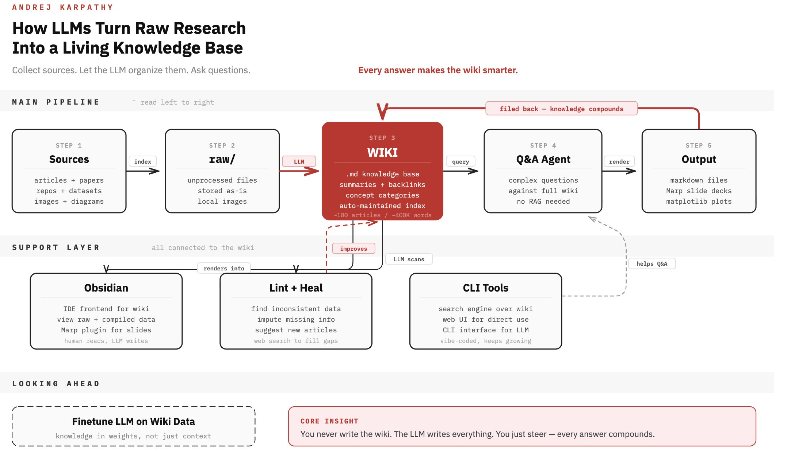

# LLM Wiki Diagram 1

This diagram presents the LLM wiki as a five-step pipeline: gather sources, store them in `raw/`, compile them into a markdown wiki, answer questions against that wiki, and render outputs that can be filed back into the knowledge base.

## Source

- Raw file: [20260405-img-5140.jpg](../../raw/assets/20260405-img-5140.jpg)
- Kind: `asset`

## Preview

## Visual Notes

- The central red `WIKI` block is the hub of the system, with arrows feeding in from `raw/` and out to Q&A and outputs.
- A top feedback arrow labeled "filed back - knowledge compounds" shows that each output can improve the wiki instead of remaining a one-off artifact.
- A support layer under the main pipeline highlights Obsidian, lint-and-heal workflows, and CLI tools as connected maintenance infrastructure.
- The footer calls out the main thesis explicitly: the human steers, while the LLM does the writing and the knowledge compounds over time.

## Key Points

- The wiki is treated as a compact compiled knowledge base rather than a loose note collection.
- Q&A is expected to run against the wiki itself, with the diagram explicitly claiming that a separate RAG stack is unnecessary at this scale.
- Lint and heal are shown as first-class maintenance loops, not optional cleanup tasks.
- Outputs include markdown, Marp slide decks, and plots, which reinforces that the wiki is an intermediate knowledge layer rather than the final deliverable.

## Evidence

- Use this image as `[Source: 20260405-img-5140.jpg]` when carrying its architecture claims into synthesis pages.

## Contradictions

- The image presents a strong "no RAG needed" claim. Treat that as a scale-dependent design choice, not a universal rule.

## Related Pages

- [LLM Wiki Architecture](../analyses/llm-wiki-architecture.md)
- [LLM Wiki Diagram 2](llm-wiki-diagram-2.md)
- [LLM Wiki Diagram 3](llm-wiki-diagram-3.md)

## Open Questions

- At what size does the "no RAG needed" assumption stop being practical?
- Which parts of lint-and-heal should stay advisory versus automatically applied?
- How much structure should outputs add back into the wiki versus remaining external render artifacts?
