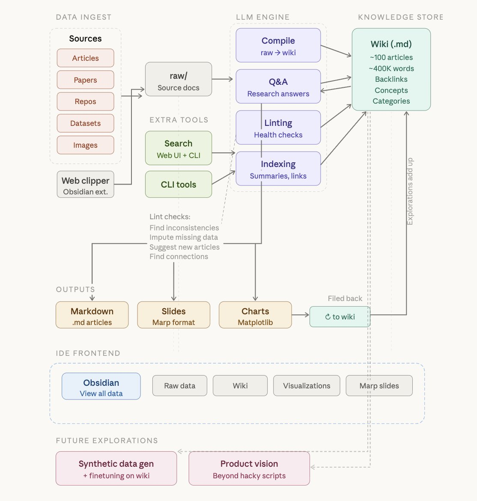

# LLM Wiki Diagram 2

This diagram reframes the same LLM wiki idea as a systems map, separating data ingest, the LLM engine, the markdown knowledge store, outputs, and the IDE frontend into distinct modules connected by explicit flows.

## Source

- Raw file: [20260405-img-5139.jpg](../../raw/assets/20260405-img-5139.jpg)
- Kind: `asset`

## Preview

## Visual Notes

- The left side groups ingestion sources such as articles, papers, repos, datasets, and images, with an Obsidian web clipper feeding them into `raw/`.
- The center column decomposes the LLM engine into compile, Q&A, linting, and indexing rather than treating the model as a single opaque step.
- The knowledge store on the right is the `Wiki (.md)` box, annotated with summaries, backlinks, concepts, and categories.
- The bottom layers show outputs and interface surfaces separately, emphasizing that markdown, slides, and charts are generated from the wiki while Obsidian remains the browsing frontend.

## Key Points

- This version makes indexing and linting explicit subsystems of the engine, which is useful for implementation planning.
- Search is positioned as both web UI and CLI support tooling, helping the user and the model navigate the existing wiki.
- The diagram treats exploration and future productization as extensions of the compiled wiki, not replacements for it.
- The "filed back" arrow reinforces that generated outputs should enrich the markdown knowledge store.

## Evidence

- Use this image as `[Source: 20260405-img-5139.jpg]` when citing the subsystem breakdown for compile, Q&A, linting, and indexing.

## Contradictions

- This diagram is more implementation-oriented than the other two. It complements them rather than conflicting with them directly.

## Related Pages

- [LLM Wiki Architecture](../analyses/llm-wiki-architecture.md)
- [LLM Wiki Diagram 1](llm-wiki-diagram-1.md)
- [LLM Wiki Diagram 3](llm-wiki-diagram-3.md)

## Open Questions

- What should the boundary be between indexing for navigation and compilation for synthesis?
- Which output types deserve dedicated generators first: briefs, slides, or charts?
- Should search remain purely local, or eventually blend wiki search with web search during heal workflows?
