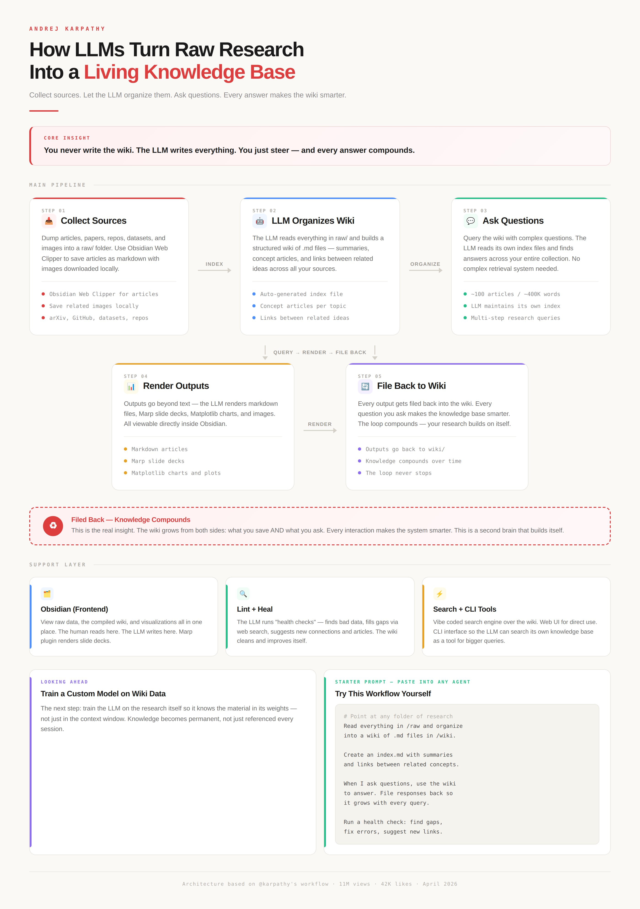

# LLM Wiki Diagram 3

This diagram turns the LLM wiki architecture into a cleaner presentation narrative, emphasizing the user journey: collect sources, let the model organize the wiki, ask questions, render outputs, and file the results back so the wiki compounds.

## Source

- Raw file: [20260405-img-5190.jpg](../../raw/assets/20260405-img-5190.jpg)
- Kind: `asset`

## Preview

## Visual Notes

- The page is designed like an explanatory landing page, with a headline, a core insight banner, and grouped cards for each step.
- The top row breaks the flow into five cards: collect sources, LLM organizes wiki, ask questions, render outputs, and file back to wiki.
- A dedicated "tools layer" highlights Obsidian, lint-and-heal, and search-plus-CLI as enabling infrastructure beneath the main loop.
- The right-hand callout "Try This Workflow Yourself" translates the diagram into an operational checklist for a real repo.

## Key Points

- This version is the clearest user-facing articulation of the workflow and is close to what a README or landing page should communicate.
- It reinforces that filing back into the wiki is not optional; it is how the system compounds knowledge instead of repeating work.
- The diagram frames the wiki as something the LLM maintains continuously while the user primarily steers and evaluates.
- It also surfaces future directions like training on wiki data and expanding beyond hacky scripts into a fuller product.

## Evidence

- Use this image as `[Source: 20260405-img-5190.jpg]` when citing the user-facing workflow and the "file back to wiki" compounding loop.

## Contradictions

- This version is the most polished and product-like. Keep that framing separate from the narrower CLI starter kit in this repo.

## Related Pages

- [LLM Wiki Architecture](../analyses/llm-wiki-architecture.md)
- [LLM Wiki Diagram 1](llm-wiki-diagram-1.md)
- [LLM Wiki Diagram 2](llm-wiki-diagram-2.md)

## Open Questions

- How much of the polished presentation flow should be encoded directly into repo docs versus kept as a higher-level product vision?
- What is the smallest set of commands that makes the workflow legible to a new user?
- Which future extensions belong in this repo and which should remain separate experiments?
